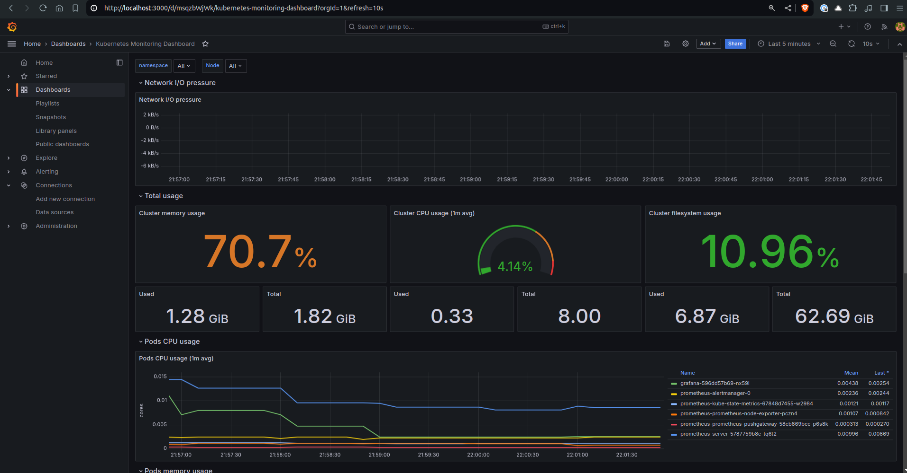
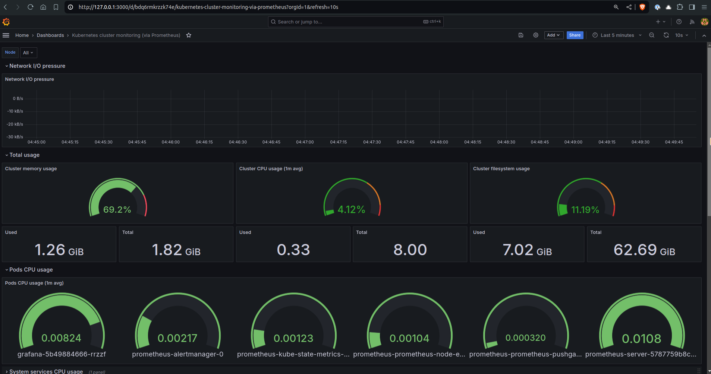
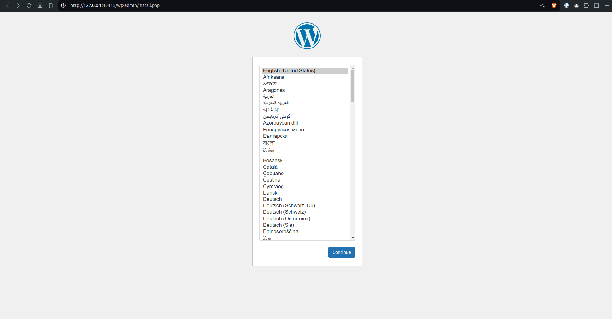
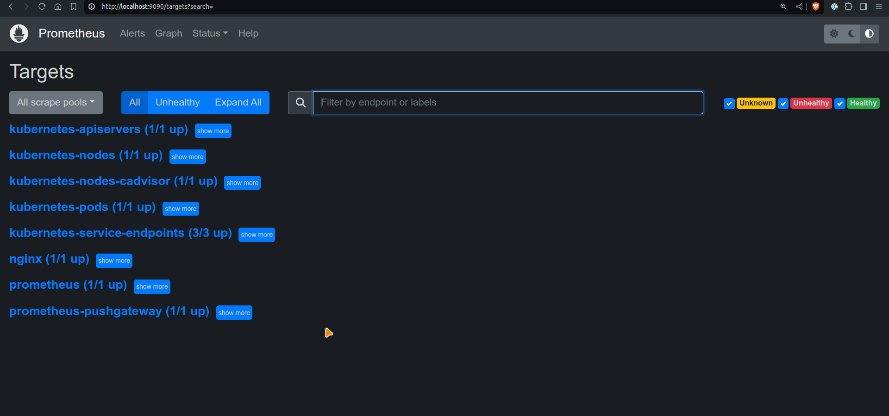
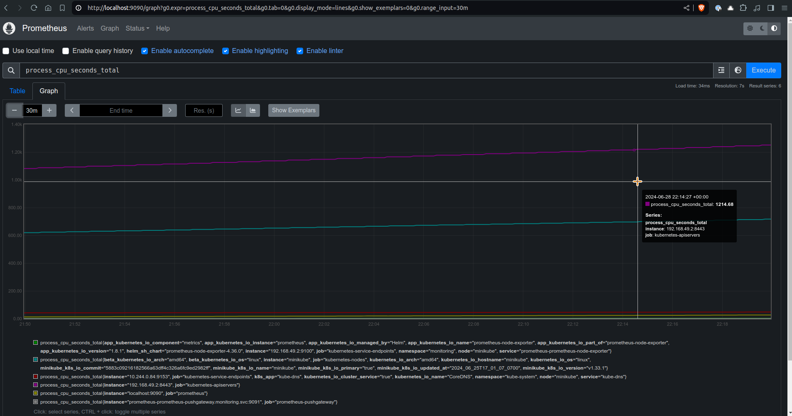

# Project Overview

This project aims to deploy a production-grade WordPress application on Kubernetes using Helm charts. It includes setting up MySQL for data storage, Nginx for reverse proxy with Lua configurations, and WordPress itself. Monitoring and alerting are implemented using Prometheus and Grafana to ensure performance and reliability. Follow the detailed steps below to replicate and manage this setup efficiently.

## Setting up a Production-Grade WordPress App on Kubernetes

### Step 1: Set Up Your EC2 Instance

1. **Update and Install Necessary Packages**:
   ```sh
    sudo apt-get update
    sudo apt-get install -y docker.io
    sudo systemctl start docker
    sudo systemctl enable docker
    sudo usermod -aG docker $USER
   ```
   Log out and log back in to apply the Docker group changes.

2. **Install Kubernetes Tools**:
    1. Update the apt package index and install packages needed to use the Kubernetes apt repository:
        ```sh
        sudo apt-get update
        sudo apt-get install -y apt-transport-https ca-certificates curl gnupg
        ```
    
    2. Download the public signing key for the Kubernetes package repositories. The same signing key is used for all repositories so you can disregard the version in the URL:
        ```sh
        curl -fsSL https://pkgs.k8s.io/core:/stable:/v1.30/deb/Release.key | sudo gpg --dearmor -o /etc/apt/keyrings/kubernetes-apt-keyring.gpg
        sudo chmod 644 /etc/apt/keyrings/kubernetes-apt-keyring.gpg 
        ```

    3. Add the appropriate Kubernetes apt repository. If you want to use a Kubernetes version different than v1.30, replace v1.30 with the desired minor version in the command below:
        ```sh
        echo 'deb [signed-by=/etc/apt/keyrings/kubernetes-apt-keyring.gpg] https://pkgs.k8s.io/core:/stable:/v1.30/deb/ /' | sudo tee /etc/apt/sources.list.d/kubernetes.list
        sudo chmod 644 /etc/apt/sources.list.d/kubernetes.list   
        ```
    4. Update the apt package index, then install kubectl:
        ```sh
        sudo apt-get update
        sudo apt-get install -y kubectl
        ```

3. **Install, Start, and Verify Minikube**:
    1. Install Minikube:
        ```sh
        curl -LO https://storage.googleapis.com/minikube/releases/latest/minikube-linux-amd64
        sudo install minikube-linux-amd64 /usr/local/bin/minikube
        ```
    
    2. Start Minikube:
        ```sh
        minikube start --driver=docker
        ```
    
    3. Verify Minikube:
        ```sh
        kubectl get nodes
        ```

### Step 2: Create Dockerfiles
1. **WordPress Dockerfile**:
   Create a file named `Dockerfile.wordpress`:

2. **MySQL Dockerfile**:
   Create a file named `Dockerfile.mysql`:

3. **Dockerfile for Nginx with OpenResty and Lua**:
    Create a file named `Dockerfile.nginx`:

### Step 3: Build and Push Docker Images to Docker Hub
```sh
docker build -t mohdaquib/wordpress:latest -f Dockerfile.wordpress .
docker build -t mohdaquib/mysql:5.7 -f Dockerfile.mysql .
docker build -t mohdaquib/nginx:latest -f Dockerfile.nginx .

docker login

docker push mohdaquib/wordpress:latest
docker push mohdaquib/mysql:5.7
docker push mohdaquib/nginx:latest
```

### Step 4: Create K8s Manifests

1. **Create Kubernetes Deployment and Service for MySQL**:
   Create a file named `mysql-deployment.yaml`:
 
2. **Create Kubernetes Deployment and Service for WordPress**:
   Create a file named `wordpress-deployment.yaml`:

3. **Create Kubernetes Deployment and Service for Nginx**:
   Create a file named `nginx-deployment.yaml`:


### Step 5: Use Helm Charts for Deployment

1. **Install Helm**:
   ```sh
   sudo snap install helm --classic
   ```

2. **Create Helm Repository for WordPress**:
   ```sh
   helm create wordpress
   ```

3. **Install WordPress Using Helm**:
   ```sh
   helm install my-wordpress ./wordpress
   ```

### Step 6: Clean Up with Helm
1. **Uninstall the Helm Release**:
   ```sh
   helm delete my-wordpress
   ```


### Step 7: Set Up Monitoring and Alerting

1. **Install Prometheus and Grafana Using Helm**:
   ```sh
   helm repo add prometheus-community https://prometheus-community.github.io/helm-charts
   helm repo add grafana https://grafana.github.io/helm-charts
   helm repo update

   helm install prometheus prometheus-community/prometheus
   helm install grafana grafana/grafana
   ```

2. **Expose Grafana**:
   ```sh
   kubectl get svc --namespace default grafana -o jsonpath="{.spec.ports[0].nodePort}"
   minikube service grafana --url
   ```

3. **Configure Prometheus to Scrape Nginx Metrics**:
   Create a file named `nginx-prometheus-exporter.yaml`:

4. **Deploy Nginx Prometheus Exporter**:
   Apply the Kubernetes manifest for nginx-prometheus-exporter:
   ```sh
   kubectl apply -f nginx-prometheus-exporter.yaml
   helm upgrade my-wordpress ./wordpress
   ```

5. **Configure Prometheus to Scrape Nginx Metrics**:
   Update your Prometheus configuration (`prometheus-config.yaml`) to include the following job:
   ```yaml
   - job_name: 'nginx'
     scrape_interval: 15s
     static_configs:
       - targets: ['nginx-prometheus-exporter-svc.default.svc.cluster.local:9113']
   ```

6. **Reload Prometheus Configuration**:
   Forward the Prometheus pod port:
   ```sh
   kubectl port-forward service/prometheus-server 9090:80 -n monitoring
   ```

7. **Verify Nginx Metrics in Prometheus**:
   Open Prometheus UI (`http://localhost:9090`) and verify that Nginx metrics are being scraped:
   - Go to **Status** -> **Targets** and check if `nginx-prometheus-exporter-svc` shows as `UP`.

8. **Set Up Grafana Dashboards**:
   Access Grafana at the NodePort service or using `minikube service` or forward the port:
   ```sh
   minikube service grafana --url
   ```
   <center> <b> OR </b> </center>

   ```sh
   kubectl port-forward --namespace monitoring service/grafana 3000:80
   ```
   Login with default credentials (admin, password).

9. **Import Grafana Dashboard for Kubernetes and Nginx**:
   - Configure the data source to Prometheus.
   - Navigate to **+ -> Import**.
   - Use the Grafana Dashboard ID for Kubernetes (315) and Nginx (12708) from Grafana's dashboard repository.


### Step 8: Clean Up

-  **Uninstall Helm Releases**:
   ```sh
	helm delete my-wordpress            
	helm delete prometheus -n monitoring 
	helm delete grafana -n monitoring
   ```


### Adding Screenshots

<details>
<summary><b>Grafana Dashboard</b></summary>
  
<!--  -->


</details>

<details>
<summary><b>Pod CPU Utilization</b></summary>
  
<!--  -->


</details>

<details>
<summary><b>WordPress UI</b></summary>
  
<!--  -->


</details>

<details>
<summary><b>Prometheus UI</b></summary>
  
<!-- 
 -->


</details>